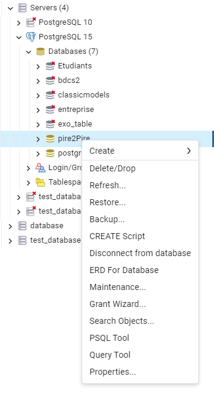

# Brief Pire2Pire.com

## TABLES DES MATIERES : 

1. [Contexte](#contexte)
2. [Definition Merise](#merise_definition)
3. [Pré-requis](#pre_requis_installation)

## Contexte <a  href ="" id="contexte"></a>

Les formations sont organisés en modules.

Chaque module est caractérisé par un numéro de module sous forme de Semantic Versionning, un intitulé, un objectif pédagogique, un contenu (textes, images et vidéos), une durée en heures, un ou plusieurs tags et un auteur.

Un module peut faire partie d'une ou plusieurs formations, comme par exemple un pire module "Commandes de base Git" pourrait faire partie d'une pire formation "Frontend Javascript" et "DevOps", voir  plus.

Un module peut contenir un texte et/ou une image et/ou une vidéo.

Les apprenants peuvent s'inscrire à une ou plusieurs formations, ils peuvent choisir de ne pas suivre certains des modules s'ils possèdent déjà, par exemple, les compétences. Autrement dit, ils peuvent arbitrairement valider les modules de leur choix en un clic.

Chaque apprenant est évalué pour chaque module et possède un état de fin de module (OK / KO).

Une formation est considérée comme terminée lorsque tous les modules ont été validés.

Chaque apprenant est caractérisé par un numéro d’inscription unique, un nom, un prénom, une adresse et une date de naissance.

Un formateurs est auteur d'un module pour une formation donnée, chaque formateur est caractérisé par un code, un nom, un prénom.

## Definition Merise  <a  href ="" id="merise_definition"></a>

Merise est une méthode d'analyse et de conceptualisation de système d'information. Elle permet de modéliser de manière structurée une base de données. Elle est découpée en trois parties : niveau conceptuel, logique et physique.

### Niveau conceptuel 

Le niveau conceptuel permet de représenter sous de schéma structuré un système d'information. Transformer des besoins métiers identifié par des règles de gestion sous la forme d'un schéma qui facilitera la construction du système d'information au niveau technique. 

Le Modèle conceptuel de données (MCD) est un schéma qui permet de modéliser au niveau de cette étape. 

Il est découpé sous forme d'entité composé de champs et de relations entre entités. 

### Niveau Logique 

Le niveau logique permet de représenter les entités et les relations plus clairement. En faisant ressortir les clés primaires et étrangères mais aussi les contraintes, il se rapproche du schéma que peut comprendre un Système de Gestion de Base de données (PhpMyAdmin ou PgAdmin). 

Le Modèle Logique de données (MLD) permet de modèliser un schéma plus proche de la réalité du système de données qui sera mis en place.

### Niveau Physique 

LE niveau physique est la traduction du modèle logique pour un SGBD personalisé. Selon le SGBD et le langage choisi, le modèle va créer un script qui sera exécutable sur le SGBD. 

L'intérêt du Modéle Physique de données (MPD) est de traduire concrétement le modèle immaginé pour qu'il soit exécutable sur un SGBD. Cette étape permet aussi d'optimiser les performances en ajoutant des index, choissisant les bons types de données et en sécurisant la base de données 

## Pré-requis <a  href ="" id="pre_requis_installation"></a>

La base de données choisie utilise le langage PostgreSQL qui comporte une spécificité : elle autorise le type JSONB pour les attributs. Ce qui différencie de MySQL ou MariaDB qui accepte le type JSON depuis MySQL 5.7 et MariaDB 10.2. 

Le JSONB est disponible depuis la version 9.4 de PostgreSQL. 

Pré-requis et Installation: 

1/Installer une version de POSTGRES > 9.4 (Lien vers les dernières version de POSTGRES selon l'OS : https://www.postgresql.org/download/)

2/Lancer postgreSQL (avec PgAdmin)

3/ Créer la database pire2pire (avec votre utilisateur. Par défaut : postgres)

4/ Ouvrir PSQL Tools 



5/ Lancer la commande pour copier le contenu du script vers PgAdmin

```sh
\i  'chemin_fichier'
```

Remplacer:
- chemin_fichier par le chemin du script sur votre ordinateur(Exemple: ./pire2pire/docs/script.sql)


> **ATTENTION!!!**  Si le fichier se trouve dans des dossiers remplacer les \ par des / ET mettez le chemin du fichier entre cote simple 

Exemple: C:\Users\script_bdd\script.sql ==> **'C:/Users/script_bdd/script.sql'**


